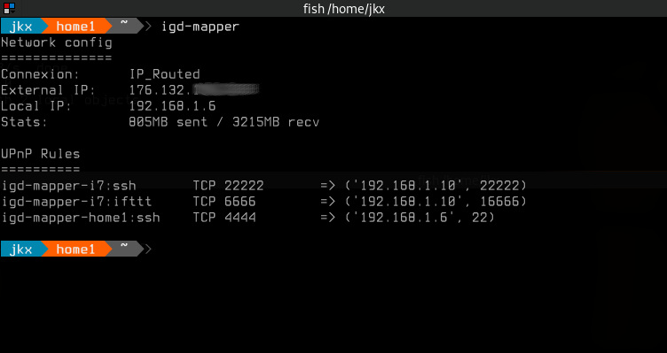

# IGD-mapper

IGD-mapper is a simple Python script used to setup IGD (Internet Gateway Device) nat rules though UPnP.
The script use a config file (/etc/igdmapper.ini) that contains the rules for a given host. 

igd-mapper can be used in interface "PostUP" script.

 

    
## Install
Several option are available:

    python setup.py install (or develop)

Install directly from github (easier) 

    pip install git+https://github.com/jkerdreux-imt/igd-mapper.git

## Run

    igd-mapper 

